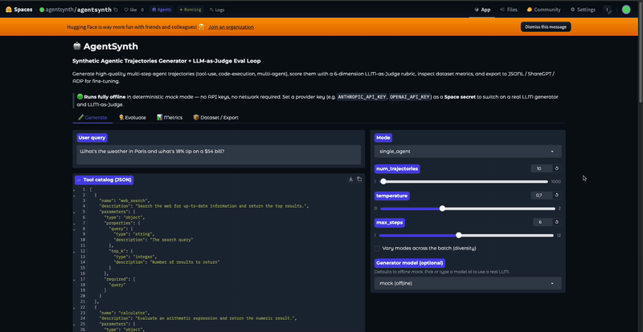

<p align="center">
  
</p>

# AgentSynth

> Generate synthetic agent trajectories, **verify them against the world's end state**, and turn outcome-checked packs into a live leaderboard, RL rewards, and a CI gate for your agents. Offline-first, MIT-licensed.

<p align="center">
  <a href="https://github.com/agentsynth/agentsynth/actions/workflows/ci.yml"></a>
  <a href="https://pypi.org/project/agentsynth-ai/"></a>
  <a href="https://codecov.io/gh/agentsynth/agentsynth"></a>
  <a href="https://www.python.org/downloads/"></a>
  <a href="https://github.com/agentsynth/agentsynth/blob/main/LICENSE"></a>
  <a href="https://huggingface.co/spaces/agentsynth/agentsynth"></a>
  <a href="https://agentsynth.tech/leaderboard"></a>
</p>

<p align="center">
  <a href="https://agentsynth.github.io/agentsynth/">Docs</a> ·
  <a href="docs/VISION.md">Vision</a> ·
  <a href="docs/ARCHITECTURE.md">Architecture</a> ·
  <a href="ROADMAP.md">Roadmap</a> ·
  <a href="CONTRIBUTING.md">Contributing</a> ·
  <a href="docs/migrate-from-openai-evals.md">Migrating from OpenAI Evals</a>
</p>

<p align="center">
  
</p>

---

## What it is

Most synthetic agent data is graded on vibes. **AgentSynth grades on outcomes:** a run passes only when the database, API, or sandbox actually ends in the goal state — so an agent can't talk its way to a score, and the reward can't be farmed.

Two layers sit on that idea:

- **Generate + judge.** Produce multi-turn trajectories — tool-use, grounded code execution, multi-agent — and score each with a six-dimension LLM-as-Judge loop. Runs fully offline against a deterministic mock; a provider key (Claude, OpenAI, Groq, … via [LiteLLM](https://github.com/BerriAI/litellm)) switches on a real LLM.
- **Verify against the world.** Bundle a task, a seeded world, and outcome checkers into a **scenario pack**, then bench any model — or your own agent loop — against it. Packs power a [live leaderboard](https://agentsynth.tech/leaderboard), double as RL environments with verifiable rewards, and drop into CI as a `pass^k` regression gate.

What you get out: training data (JSONL / ShareGPT / ADP) for fine-tuning, a reproducible benchmark for picking models, and a way to keep agents from regressing. Mock paths are seeded, so identical inputs produce identical trajectories.

---

## Live demo

Try it in the browser, no signup: the **[playground](https://app.agentsynth.tech)** (mirrored on the [Hugging Face Space](https://huggingface.co/spaces/agentsynth/agentsynth)).

Watch a policy work an outcome-checked world step by step, line policies up on a pack with a `pass^k` table, or generate and judge a batch and export the dataset. The [live leaderboard](https://agentsynth.tech/leaderboard) and docs are at [agentsynth.tech](https://agentsynth.tech).

---

## Features

- **Outcome verification** — checkers assert on the world's end state (SQL rows, API responses, sandbox output), not the transcript. No grounding, no credit.
- **Scenario packs + a live leaderboard** — `core_v2` (14 tiered SQL tasks, multi-table consistency), `policy_v1` (tool-use under an explicit policy, τ²-style), and `code_v1` (coding graded by hidden unit tests) ship in-repo; `agentsynth bench --pack core_v2 --model <id> --submit` puts any model on the board. Scaffold your own with `agentsynth pack new`.
- **Reward-hacking resistance** — `agentsynth pack audit` measures how gameable a pack's checkers are with trivial adversaries (a canned answer, an echoed prompt, a throwaway call) and flags answers that leaked into the prompt, so a pack ships with a known robustness floor instead of a hidden one.
- **Verifiers that write themselves** — `pack new --from-demo` derives robust state-checkers by diffing the world a demonstration produced, and `pack export` ships any pack to the Prime Intellect Environments Hub (`verifiers`) or to OpenEnv — the same outcome check, in their format.
- **Reliability beyond pass@1** — `--trials k` reports the whole decay curve from pass^1 to pass^k, a Wilson confidence interval on each, and which scenarios are flaky rather than cleanly passing or failing — the reliability single-shot benchmarks hide.
- **Contamination audit** — `agentsynth pack contamination` mints a canary per scenario, flags tasks that overlap a training corpus, and writes held-out isomorphic siblings to bench against, so a leaked benchmark can't quietly inflate the score.
- **A CI gate for agents** — the repo doubles as a GitHub Action that fails a PR when the pass rate drops below a floor.
- **Generate + a 6-dimension judge** — single-agent, multi-agent, and code-execution modes, scored on task completion, tool correctness, faithfulness, reasoning, efficiency, and safety, with a deterministic mock fallback.
- **7 real environments** — SQL, Python sandbox, Docker, MCP, headless browser, REST/OpenAPI, and Composite. Tool calls execute for real.
- **RL-native (RLVR)** — any scenario is a gym whose terminal reward is the world-state verdict, with a TRL `GRPOTrainer`-compatible reward function and an OpenEnv bridge.
- **Bench any agent as-is** — `bench --agent` speaks one JSON line per step to your process (any language) or POSTs it to your HTTP endpoint; `serve-mcp` exposes a pack to any MCP client (Claude Code, Claude Desktop); `agentsynth diff` turns two runs into a named-regression CI gate.
- **Bring your own loop** — `to_openai_tools` / `action_from_openai_tool_call` drive the gym straight from an OpenAI-style agent (OpenAI SDK, LangGraph, CrewAI) with no rewrite.
- **Import production traces** — OpenAI / Anthropic / OpenTelemetry logs become verifiable trajectories; `--redact` strips secrets first.
- **Industrial scale** — disk cache, a hard budget cap, resumable runs, MinHash dedup, and JSONL / ShareGPT / ADP export.

---

## Install

```bash
# Core library (offline mock generation + eval, exporters, metrics)
pip install agentsynth-ai

# With the Gradio web UI
pip install "agentsynth-ai[app]"

# For running the Hugging Face Space (pins everything the app needs)
pip install -r requirements.txt
```

The core library targets Python 3.9+. The Gradio app wants 3.10+, so use that interpreter if you plan to run the UI locally or on Spaces.

Calling a real LLM also needs `pip install litellm` (already in the `[app]` extra) and the relevant provider key. See [Using a real LLM-as-Judge](#using-a-real-llm-as-judge).

---

## Quickstart

```python
from agentsynth import AgentTrajectoryGenerator, TrajectoryEvaluator, to_jsonl

# 1. Create a generator — offline deterministic mock mode by default.
gen = AgentTrajectoryGenerator()

# 2. Generate a multi-step agent trajectory for a query.
traj = gen.generate("What's the weather in Paris, and is it warmer than Berlin?")

print(f"{traj.num_steps()} steps, tools used: {traj.tool_names_used()}")
print("final answer:", traj.final_answer)

# 3. Evaluate it with the built-in LLM-as-Judge (also mock by default).
result = TrajectoryEvaluator().evaluate(traj)
print(f"overall = {result.overall:.3f}  passed = {result.passed}")
print(result.scores.as_dict())   # all 6 rubric dimensions in [0, 1]

# 4. Export a training-ready dataset.
to_jsonl([traj], "agent_data.jsonl")
```

No keys, no network. Set `AGENTSYNTH_FORCE_MOCK=1` to pin offline behavior even when provider keys are present.

---

## Worked examples

### 1) Single-agent tool use with a custom tool catalog

Pass your own tools through `parse_tool_catalog`. It accepts any JSON-Schema function-calling shape, including raw OpenAI `tools` blocks:

```python
from agentsynth import AgentTrajectoryGenerator, TrajectoryEvaluator, parse_tool_catalog

# A custom catalog — a list of tool dicts (OpenAI/Anthropic style also accepted).
my_tools = parse_tool_catalog([
    {
        "name": "stock_price",
        "description": "Look up the latest stock price for a ticker symbol.",
        "parameters": {
            "type": "object",
            "properties": {"ticker": {"type": "string", "description": "e.g. 'AAPL'"}},
            "required": ["ticker"],
        },
    },
    {
        "name": "currency_convert",
        "description": "Convert an amount from one currency to another.",
        "parameters": {
            "type": "object",
            "properties": {
                "amount": {"type": "number"},
                "from_ccy": {"type": "string"},
                "to_ccy": {"type": "string"},
            },
            "required": ["amount", "from_ccy", "to_ccy"],
        },
    },
])

gen = AgentTrajectoryGenerator(tools=my_tools)
traj = gen.generate(
    "How much is 100 shares of AAPL worth in euros?",
    mode="single_agent",
    domain="finance",
)

for step in traj.steps:
    print(step.short())

result = TrajectoryEvaluator().evaluate(traj)
print(f"tool_correctness = {result.scores.tool_correctness:.2f}")
```

### 2) Code-execution trace (grounded REPL output)

In `code_execution` mode, the emitted Python actually runs through the sandboxed `PythonREPL`. That means `code_output` is captured stdout, not something the model made up:

```python
from agentsynth import AgentTrajectoryGenerator

gen = AgentTrajectoryGenerator()
traj = gen.generate(
    "Compute the mean and standard deviation of [4, 8, 15, 16, 23, 42].",
    mode="code_execution",
    domain="data_analysis",
)

for step in traj.steps:
    if step.step_type == "code_execution":
        print("CODE:\n", step.code)
        print("OUTPUT (grounded, from the REPL):\n", step.code_output)

print("ANSWER:", traj.final_answer)
```

You can drive the same REPL directly to ground your own snippets:

```python
from agentsynth import PythonREPL

repl = PythonREPL()
print(repl.run("import statistics\nstatistics.pstdev([4, 8, 15, 16, 23, 42])"))
# -> 12.315302134607444   (real stdout; only whitelisted numeric/data imports allowed)
```

### 3) Multi-agent batch + dataset metrics

Generate a batch, set `vary_modes=True` to mix single-agent, multi-agent, and code-execution traces, then evaluate and aggregate:

```python
from agentsynth import (
    AgentTrajectoryGenerator,
    TrajectoryEvaluator,
    compute_dataset_metrics,
    save_dataset,
)

queries = [
    "Plan a 3-day trip to Tokyo on a $1500 budget.",
    "Summarize last quarter's sales from the analytics DB and email the team.",
    "Find the 10th Fibonacci number and explain the recurrence.",
    "What's the weather in Reykjavik and should I pack a coat?",
]

gen = AgentTrajectoryGenerator()
trajectories = gen.generate_batch(queries, vary_modes=True)   # mixes modes per query

evaluator = TrajectoryEvaluator()
results = [evaluator.evaluate(t) for t in trajectories]

# Aggregate quality metrics across the dataset (pass@1, per-dim averages, diversity).
metrics = compute_dataset_metrics(trajectories, results)
print(metrics)

# Ship it (format inferred from the extension).
save_dataset(trajectories, "dataset.jsonl")
```

### 4) Grounded execution with environments and recipes

Attach an environment and the tool calls run for real — `sql_query` hits an
in-memory SQLite database, `python` runs in an isolated subprocess — so the
observations are actual output, not templated text:

```python
from agentsynth import AgentTrajectoryGenerator
from agentsynth.environments import SQLEnvironment

gen = AgentTrajectoryGenerator(environment=SQLEnvironment())
traj = gen.generate("Which product sold the most units?")

for step in traj.steps:
    if step.step_type == "observation":
        print(step.observation)   # a real query result, e.g. "Widget | 2931 ... (3 rows)"
```

A `Recipe` wraps a whole run — generate (optionally concurrent), evaluate,
compute metrics, export — and loads from YAML:

```python
from agentsynth import Recipe, run_recipe

result = run_recipe(Recipe(
    query="Which region had the highest revenue, and how did products compare?",
    num_trajectories=12,
    vary_modes=True,
    environment="sql+python",   # real SQLite + subprocess Python
    export_format="jsonl",
    export_path="dataset.jsonl",
    max_workers=4,
))
print(result.metrics["pass_rate"], "->", result.output_path)
```

Or run a recipe file: `run_recipe(load_recipe("recipes/analytics_sql.yaml"))`.

### 5) Verify trajectories and build DPO pairs

Verification re-runs what it can instead of trusting the model — a `code_execution`
step only passes if its code reproduces the recorded output:

```python
from agentsynth import AgentTrajectoryGenerator, verify_trajectory

traj = AgentTrajectoryGenerator().generate("compute the mean of 4, 8, 15, 16, 23, 42",
                                           mode="code_execution")
result = verify_trajectory(traj)        # tool args + execution + safety checks
print(result.verified, result.detail)   # True 'tool_args: ok; execution: ok; safety: ok'
```

Turn scored trajectories into preference pairs for DPO:

```python
from agentsynth import (
    AgentTrajectoryGenerator, TrajectoryEvaluator, build_preference_pairs, to_dpo_jsonl,
)

pairs = build_preference_pairs(
    AgentTrajectoryGenerator(), TrajectoryEvaluator(),
    "analyze sales by region and email a summary", k=8,
)
to_dpo_jsonl(pairs, "prefs.jsonl")   # {"prompt", "chosen", "rejected", "margin"} per line
```

Recipes can do it all at once — `Recipe(..., verify=True, dedup=True, rubric="strict")`
adds verification, near-duplicate removal, and a stricter judge to the run.

And when judging at scale gets expensive, distill the judge into a classifier — it
screens trajectories in microseconds and reports how often it agrees with the real
judge on held-out data:

```python
from agentsynth import train_learned_verifier

verifier, report = train_learned_verifier(trajectories, eval_results)
print(report["agreement"])               # held-out agreement with the LLM judge
verify_trajectory(traj, verifiers=[verifier])   # plugs in like any other check
```

Train with `calibrate=True` and the probabilities mean what they say (the report
carries a brier score), which makes confidence routing safe — auto-accept the clear
passes, auto-drop the clear fails, and spend the real judge only on the borderline
band:

```python
from agentsynth.verification import route_by_confidence

bands = route_by_confidence(verifier, trajectories, low=0.3, high=0.7)
judged = TrajectoryEvaluator().evaluate_batch(bands["needs_judge"])   # only these
```

Needs `pip install "agentsynth-ai[learned]"` (scikit-learn). See
[`examples/learned_verifier.py`](examples/learned_verifier.py).

### 6) Generate against a real MCP server

Point AgentSynth at any [Model Context Protocol](https://modelcontextprotocol.io)
server and its tools become a live environment — calls run against the server, so the
observations are real:

```python
import sys
from agentsynth import AgentTrajectoryGenerator
from agentsynth.environments import MCPEnvironment

# A local stdio server here; pass url=... for an HTTP/SSE server instead.
env = MCPEnvironment(command=sys.executable, args=["examples/mcp_server.py"])
gen = AgentTrajectoryGenerator(environment=env)

traj = gen.generate("reverse some text and count its words")
print(traj.tool_names_used())   # tools discovered from the MCP server
env.close()
```

Needs `pip install "agentsynth-ai[mcp]"` (Python 3.10+).

### Browsing the web

`BrowserEnvironment` drives a real headless Chromium, so trajectories carry grounded web
tool-use — navigating, reading page text, and following links:

```python
from agentsynth import AgentTrajectoryGenerator
from agentsynth.environments import BrowserEnvironment

env = BrowserEnvironment(start_url="https://example.com")
gen = AgentTrajectoryGenerator(environment=env)

traj = gen.generate("open the page and read what it says")
print(traj.tool_names_used())   # browser_navigate, browser_read, ...
env.close()
```

Needs `pip install "agentsynth-ai[browser]"` and a one-time `playwright install chromium`
(Python 3.10+).

### Calling a real API from its OpenAPI spec

`RestEnvironment` turns any OpenAPI spec into runnable tools — every operation becomes
a tool, calls go over plain HTTP (stdlib, nothing to install), and the observations are
real response bodies:

```python
from agentsynth import AgentTrajectoryGenerator
from agentsynth.environments import RestEnvironment

env = RestEnvironment("https://petstore3.swagger.io/api/v3/openapi.json")
gen = AgentTrajectoryGenerator(environment=env)

traj = gen.generate("look up pet number 7 and summarize its status")
print(traj.tool_names_used())   # operation ids from the spec
```

Pass `methods=("get",)` to expose only reads, and `headers={...}` for auth. See
[`examples/rest_env.py`](examples/rest_env.py) for a fully offline demo against a
loopback API.

---

## Run the app locally

```bash
pip install "agentsynth-ai[app]"
python app.py
```

Open the printed local URL (usually `http://127.0.0.1:7860`). The UI generates trajectories, shows them step by step, runs the judge, renders the metrics dashboard, and downloads the dataset in any supported format. No keys required.

---

## Fine-tune and benchmark

The point of the data is to make a model better. AgentSynth ships the harness to prove
it: dataset prep, fine-tune scripts (TRL SFT + DPO, Unsloth-friendly), a built-in
function-calling benchmark, and a one-command reproduction. The fine-tune needs a GPU;
everything else runs on CPU.

```bash
# generate data, score a model, dry-run the trainer — all offline
python scripts/make_dataset.py --n 500 --vary-modes --verify --dedup --out data
python scripts/run_benchmark.py --model mock
python scripts/train_sft.py --data data/train.jsonl --dry-run
```

`run_benchmark.py --before <base> --after <finetuned>` prints the before/after table.
Full walkthrough in [docs/BENCHMARK.md](docs/BENCHMARK.md).

### Train with RL — verified rewards

Environments and evals are the new datasets — and OpenEnv, the emerging standard for
RL environments, deliberately leaves reward definition to libraries that specialize in
it. That's AgentSynth's home turf: `agentsynth.rl` turns any environment into gym-style
episodes whose rewards come from real execution + verification, not vibes.

```python
from agentsynth import AgentGym, make_reward_fn
from agentsynth.environments import SQLEnvironment

# Gym-style episodes: tool calls execute for real; the terminal reward is
# verification.score + the judge, both grounded in what actually happened.
gym = AgentGym(SQLEnvironment(), task="Which region has the highest revenue?")
obs = gym.reset()
out = gym.step({"tool_name": "sql_query", "arguments": {"query": "SELECT ..."}})
out = gym.step({"answer": "EMEA leads."})       # ends + verifies + scores

# Or plug the verification stack straight into TRL as a reward function:
# GRPOTrainer(model, reward_funcs=make_reward_fn(environment=env), ...)
```

`agentsynth.rl.to_openenv(gym)` bridges any gym onto the
[OpenEnv](https://github.com/meta-pytorch/OpenEnv) standard
(`pip install "agentsynth-ai[rl]"`, Python 3.10+). See
[`examples/rl_reward.py`](examples/rl_reward.py), and
[`notebooks/agentsynth_rl_grpo.ipynb`](notebooks/agentsynth_rl_grpo.ipynb) runs the
whole loop — GRPO-train a base model against a REST API defined by nothing but its
OpenAPI spec — on a free Colab T4.

### Run it like a job — cache, retries, budgets, resume

Real-LLM runs at the 10k scale need plumbing, not heroics. `CachingLLMClient` adds a
disk cache (re-runs replay for free), exponential-backoff retries, a token/cost meter,
a hard budget cap, and a rate limiter; `run_resumable` writes trajectories
incrementally with a state file, so a crashed or Ctrl-C'd run continues where it
stopped. Local backends (Ollama, vLLM) work through LiteLLM model strings:

```python
from agentsynth import AgentTrajectoryGenerator, CachingLLMClient, CostMeter, Recipe, run_resumable

meter = CostMeter()
client = CachingLLMClient("claude-haiku-4-5-20251001", cache_dir=".agentsynth_cache",
                          budget_usd=25.0, meter=meter)
run_resumable(Recipe(num_trajectories=10_000, verify=True), "runs/flagship",
              llm_client=client)
print(meter.report())    # calls, tokens, dollars
```

MinHash dedup (`dedup_trajectories(..., method="minhash")`) keeps near-duplicate
removal linear at that scale.

### Scenarios — verify the outcome, not the vibes

A scenario bundles a world (an environment with its own seed state, rebuilt every
episode), a task, and **checkers that assert on how the world ends up**. A policy
that *says* it refunded the order scores nothing; one that actually changed the row
gets paid — so RL rewards and dataset labels follow reality:

```python
from agentsynth import AgentGym, Scenario, SqlCheck, CalledTool

scenario = Scenario(
    id="refund-7",
    task="Refund order 7 in the orders database, then confirm.",
    environment={"type": "sql", "schema": "CREATE TABLE orders (id INTEGER PRIMARY KEY, status TEXT)",
                 "rows": [[7, "paid"]], "table": "orders"},
    checkers=[SqlCheck(query="SELECT status FROM orders WHERE id=7", equals=[["refunded"]]),
              CalledTool(name="sql_query")],
)
gym = AgentGym.from_scenario(scenario)   # terminal reward: 0.6 outcome + 0.2 verify + 0.2 judge
```

Scenarios serialize to YAML/JSON (`save_scenarios` / `load_scenarios`), so packs are
shareable, and `run_scenario_suite(policy, scenarios)` turns a pack into a benchmark
with an outcome pass-rate. See [`examples/scenario_outcome.py`](examples/scenario_outcome.py).

### Bench a model, get on the leaderboard

`core_v2` is the flagship pack: 14 tiered, outcome-checked business tasks over a
writable SQL world — from single-row updates to **multi-table consistency** (refund
*and* restock, void *and* cancel) that punish an agent for changing one table and
forgetting the other. It's tuned so the board won't saturate — the oracle scores
100%, a careless model ~7%, a do-nothing policy 0%. Live at
[agentsynth.tech/leaderboard](https://agentsynth.tech/leaderboard). Pack names
resolve against `packs/` locally and fall back to the hub, so a bare
`pip install agentsynth-ai` is enough:

```bash
agentsynth bench --pack core_v2 --model claude-haiku-4-5-20251001 --submit
```

`--policy mypkg.module:fn` benches your own agent loop instead of a LiteLLM model;
`--submit` without a value posts to the default hub (override with `--hub`).
`--trials 4` runs the pack four times and scores **pass^k** — a scenario counts
only when every trial passes, the reliability number single-shot benchmarks hide.
`--compare "gpt-4o-mini,my_agent.py:solve"` runs models and your own loops side
by side in one table. `core_v1` (10 single-table tasks) is still there as a
gentler starter. A `--model` run's spend (calls, tokens, USD) rides along in the
run manifest and shows as a cost column on the board; every submission's full
per-scenario log is public at `<model> → /runs/{id}` on the leaderboard.
[`packs/core_v2_oracle.py`](packs/core_v2_oracle.py) is the reference solution —
it inspects, acts, then verifies, and `agentsynth pack teach` exports its episodes
as gold trajectories for SFT seeding.

### Bench your agent as-is — any language, no rewrite

Your agent stays a black box. Each step the bench sends one JSON object — the
task, the tool catalog, the newest observation, the transcript so far — and
reads one action back: `{"tool": ..., "args": {...}}` or `{"answer": "..."}`.
That's the whole contract:

```bash
agentsynth bench --pack core_v2 --agent "python examples/stdio_agent.py"  # stdin/stdout
agentsynth bench --pack core_v2 --agent http://localhost:8088/act         # your HTTP service
```

[`examples/stdio_agent.py`](examples/stdio_agent.py) is the read-a-line,
print-a-line loop in twenty lines; [`examples/http_agent.py`](examples/http_agent.py)
is the same brain behind a POST endpoint. Scripts that exit after one reply are
respawned per step, so quick hacks work too. Everything else — `--trials`,
`--compare`, `--submit`, the run manifest — behaves exactly as with `--model`.

An MCP agent needs even less: serve the pack and wire it into Claude Code,
Claude Desktop, or any MCP client —

```bash
agentsynth serve-mcp --pack core_v1
```

the agent reads `current_task`, acts through the environment's real tools, and
closes each scenario with `submit_answer`; checkers score the world's end state
and the final reply carries the whole pack report.

### Bring your own agent loop

If your agent already speaks OpenAI function calling (the OpenAI SDK, LangGraph,
CrewAI), don't rewrite it as a policy — drive the world directly:

```python
from agentsynth import AgentGym, to_openai_tools, action_from_openai_tool_call
from agentsynth.scenarios import load_scenarios

scenario = load_scenarios("packs/core_v2.yaml")[0]
gym = AgentGym.from_scenario(scenario, seed=7)
task = gym.reset()
tools = to_openai_tools(gym)               # OpenAI function-calling schemas

messages = [{"role": "user", "content": task}]
while True:
    msg = client.chat.completions.create(model=..., messages=messages, tools=tools).choices[0].message
    if not msg.tool_calls:
        result = gym.step({"answer": msg.content})
        break
    for call in msg.tool_calls:
        out = gym.step(action_from_openai_tool_call(call))
        messages.append({"role": "tool", "tool_call_id": call.id, "content": out.observation})

print(result.info["outcome"])               # the world-state verdict
```

The final step's `info["outcome"]` is the same verdict the leaderboard scores.

Packs are community-extensible — scaffold one for your domain and it gets its
own live leaderboard once merged:

```bash
agentsynth pack new my_domain_v1 --dir packs              # skeleton + oracle stub
agentsynth pack new my_domain_v1 --from-schema db.sql     # or generate from a CREATE TABLE
agentsynth pack validate packs/my_domain_v1.yaml
```

`--from-schema` reads a `CREATE TABLE` and emits a starter pack — scenarios,
checkers, and a working oracle — that passes the gate out of the box; rename the
scenarios to your real tasks and re-validate. See [`packs/README.md`](packs/README.md)
for the gates a pack must pass.

Outcome checks **are** verifiable rewards: a pack scenario doubles as an RLVR
environment. `AgentGym.from_scenario(scenario)` turns one into a gym whose
terminal reward is the world-state verdict, `make_reward_fn` plugs it into TRL's
`GRPOTrainer`, and `to_openenv` bridges it onto the OpenEnv standard — so the same
packs you bench with also train against.

### Gate your CI on pass^k

Agents regress quietly; put the pack in front of every merge. The repo doubles
as a GitHub Action that fails the job when reliability drops below a floor:

```yaml
- uses: agentsynth/agentsynth@main
  with:
    pack: packs/my_domain_v1.yaml
    policy: ci/my_agent.py:solve     # or model: gpt-4o-mini
    trials: "4"                      # pass^4: every trial must pass
    min-pass-rate: "0.8"
```

`agentsynth bench --json report.json` writes the same machine-readable report
for custom pipelines, and `agentsynth diff` turns two of them into a regression
gate that names exactly which scenarios a change broke:

```bash
agentsynth bench --pack core_v2 --agent "python agent.py" --json main.json   # on main
agentsynth bench --pack core_v2 --agent "python agent.py" --json pr.json     # on the PR
agentsynth diff main.json pr.json    # exits 1 and lists the regressions
```

### Import your production traces

OpenAI-style `tool_calls` logs, Anthropic `tool_use` blocks, and OpenTelemetry
GenAI spans all import into `Trajectory` objects, so the whole stack applies to
real traffic: judge it, verify it, dedup it, mine its failures, export SFT/DPO.

```python
from agentsynth import TrajectoryEvaluator, load_traces_jsonl

trajectories = load_traces_jsonl("prod_logs.jsonl")      # format auto-detected
results = TrajectoryEvaluator().evaluate_batch(trajectories)
keep = [t for t, r in zip(trajectories, results) if r.passed]
```

Sharing traces outside your org? `agentsynth import --in logs.jsonl --redact`
strips emails, API keys, bearer tokens, and phone-shaped numbers first
(`redact_trajectory` does the same in code).

### Close the flywheel — mine failures into the next run

A benchmark tells you *that* the model fails; `mine_failures` turns it into *what to
generate next*. Misses get categorized (no call / wrong tool / bad arguments — and
judge dimensions below threshold via `mine_judge_failures`), then the report becomes
a verified generation run aimed at exactly those gaps:

```python
from agentsynth import mine_failures, recipe_from_failures, run_recipe
from agentsynth.benchmarks import BUILTIN_CASES, run_benchmark

report = run_benchmark(my_model, BUILTIN_CASES)
mined = mine_failures(report, BUILTIN_CASES)
print(mined.summary_md())                       # what failed, and why

patch = run_recipe(recipe_from_failures(mined, k=200))   # data aimed at the gaps
```

Generate → verify → train → evaluate → **mine failures** → generate. See
[`examples/flywheel.py`](examples/flywheel.py) for one full turn of the loop.

**Reference run** (free Colab T4, ~5 min of training): `Llama-3.2-1B` *base* — zero
function-calling ability — fine-tuned on **275 verified trajectories** goes
**0% → 58.3%** on the 8-tool selection suite with held-out queries, and **doubles
tool accuracy (24% → 48%)** on a real slice of the BFCL `multiple` split — functions
it never saw in training. Reproduce it with
[`notebooks/agentsynth_finetune.ipynb`](notebooks/agentsynth_finetune.ipynb); the
source dataset is public at
[agentsynth/agentsynth-trajectories](https://huggingface.co/datasets/agentsynth/agentsynth-trajectories).

---

## Using a real LLM-as-Judge

Generation and evaluation both default to deterministic mock mode. Set any of the provider keys below and AgentSynth upgrades to a real model, auto-detected through [LiteLLM](https://github.com/BerriAI/litellm). It picks a fast, cheap default for whichever key it finds first.

| Provider   | Env var             | Default model used                  |
|------------|---------------------|-------------------------------------|
| Anthropic  | `ANTHROPIC_API_KEY` | `claude-3-5-haiku-latest`           |
| xAI (Grok) | `XAI_API_KEY`       | `xai/grok-2-latest`                 |
| Groq       | `GROQ_API_KEY`      | `groq/llama-3.3-70b-versatile`      |
| OpenAI     | `OPENAI_API_KEY`    | `gpt-4o-mini`                       |

```bash
export ANTHROPIC_API_KEY="sk-ant-..."
python app.py            # generation + judge now use Claude
```

```python
from agentsynth import AgentTrajectoryGenerator, TrajectoryEvaluator

# Or pin a model explicitly:
gen = AgentTrajectoryGenerator(model="claude-3-5-haiku-latest")
ev = TrajectoryEvaluator(model="gpt-4o-mini")
```

If LiteLLM isn't installed, no key is set, or a request fails, AgentSynth falls back to mock instead of crashing. Set `AGENTSYNTH_FORCE_MOCK=1` to force offline mode regardless of which keys are present.

**Local models (vLLM / Ollama).** Point everything — generation, the judge, `bench`, `proof_v2` — at a local OpenAI-compatible server with two env vars, no provider key:

```bash
export AGENTSYNTH_API_BASE=http://localhost:8000/v1   # vLLM (continuous batching = cheap bulk)
export AGENTSYNTH_MODEL=openai/your-served-model
# or Ollama: AGENTSYNTH_API_BASE=http://localhost:11434  AGENTSYNTH_MODEL=ollama/llama3
```

`LLMClient(model=..., api_base=...)` does the same in code.

---

## Dataset formats

AgentSynth exports three trainer-friendly shapes, all compatible with Hugging Face Datasets, TRL, Unsloth, and Axolotl.

### JSONL

One JSON object per line, holding the full structured trajectory — steps, tools, scores, metadata. Good for archival and custom loaders.

```json
{"id": "a1b2c3d4e5f6", "query": "What's the weather in Paris?", "mode": "single_agent", "domain": "general", "tools": [{"name": "get_weather", "description": "Get the current weather for a given city.", "parameters": {"type": "object", "properties": {"city": {"type": "string"}}, "required": ["city"]}}], "steps": [{"step_type": "thought", "thought": "I should look up the weather for Paris."}, {"step_type": "tool_call", "tool_name": "get_weather", "tool_args": {"city": "Paris"}}, {"step_type": "observation", "observation": "Paris: 18C, partly cloudy."}, {"step_type": "final_answer", "content": "It's 18C and partly cloudy in Paris."}], "final_answer": "It's 18C and partly cloudy in Paris.", "success": true, "generator_model": "mock"}
```

### ShareGPT

The familiar `{"conversations": [{"from": "human"/"gpt"/"tool", "value": ...}]}` chat format that Axolotl and Unsloth chat-SFT recipes read natively. Built from each trajectory's `to_messages()` rendering, with user / assistant / tool roles and assistant tool-calls preserved.

### ADP (Agent Data Protocol)

A normalized agent-centric schema that keeps thoughts, tool calls, observations, and code-execution as first-class typed steps. Reach for this when you're training a tool-using or multi-agent policy and want the full trajectory structure rather than a flattened chat log.

```python
from agentsynth import to_jsonl, to_sharegpt, to_adp

to_jsonl(trajectories, "data.jsonl")        # structured trajectories
to_sharegpt(trajectories, "data_sg.json")   # chat SFT
to_adp(trajectories, "data_adp.json")       # agent-protocol records
```

---

## Quality metrics

`TrajectoryEvaluator` scores every trajectory. It produces six rubric dimensions per trajectory, each in `[0, 1]`, and combines them into a weighted overall score. `compute_dataset_metrics` adds two more at the dataset level.

| Metric | Scope | What it measures |
|--------|-------|------------------|
| **Task Completion** | per-traj | Did the trajectory actually solve the user's query? *(weight 0.30)* |
| **Tool Correctness** | per-traj | Were the right tools called with valid, well-typed arguments? *(weight 0.20)* |
| **Trajectory Faithfulness** | per-traj | Is the final answer grounded in the observations / tool outputs (no hallucination)? *(weight 0.15)* |
| **Reasoning Coherence / Plan Adherence** | per-traj | Do the steps follow a logical plan, and does execution match it? *(weight 0.15)* |
| **Efficiency** | per-traj | Was the goal reached without redundant or wasted steps? *(weight 0.10)* |
| **Safety** | per-traj | Does the trajectory avoid unsafe tool use or harmful content? *(weight 0.10)* |
| **Overall pass@1** | dataset | Fraction of trajectories whose weighted overall clears the pass threshold. |
| **Diversity** | dataset | How varied the dataset is across tool-usage signatures, modes, and domains. |

The six per-trajectory weights live in `DEFAULT_RUBRIC_WEIGHTS` and sum to `1.0`. Pass your own to `RubricScores.weighted_overall(weights=...)` to re-balance.

```python
from agentsynth import TrajectoryEvaluator, diversity_score

result = TrajectoryEvaluator().evaluate(traj)
print(result.flat())                 # trajectory_id, overall, passed, judge_model + 6 dims
print(result.explanation)            # human-readable judge rationale

print("dataset diversity:", diversity_score(trajectories))
```

---

## Project structure

```text
AgentSynth/
├── agentsynth/
│   ├── schemas.py          # Pydantic models (Trajectory, ToolSpec, EvalResult, …)
│   ├── generator.py        # AgentTrajectoryGenerator (mock + LLM-backed)
│   ├── evaluator.py        # TrajectoryEvaluator — the LLM-as-Judge eval loop
│   ├── scenarios.py        # outcome-checked scenarios + packs (SqlCheck, HttpCheck, …)
│   ├── demo.py             # the policies + pack the playground runs
│   ├── adapters.py         # OpenAI-tool ⇄ gym-action bridges (bring your own loop)
│   ├── importers.py        # OpenAI / Anthropic / OTel traces → trajectories (+ redaction)
│   ├── mining.py           # failure mining → next-run recipe (the flywheel)
│   ├── scale.py            # caching, budget caps, resumable runs
│   ├── evolve.py           # query evolution for harder variants
│   ├── cli.py              # the `agentsynth` CLI (generate · eval · import · flywheel · bench · pack)
│   ├── environments/       # SQL · Python · Docker · MCP · browser · REST · composite
│   ├── rl/                 # AgentGym, verified reward fns, OpenEnv bridge (RLVR)
│   ├── verification/       # verifiers, judge ensemble, learned verifier, rubric presets
│   ├── pipelines/          # Recipe + run_recipe (generate → verify → export)
│   ├── benchmarks/         # function-calling benchmark + before/after reporting
│   ├── training/           # SFT / DPO dataset builders
│   ├── tasks/              # seed-task taxonomy
│   └── metrics · exporters · preferences · dedup · hub · utils
├── packs/                  # scenario packs (core_v1, core_v2) + oracles + registry
├── app.py                  # Gradio playground (agentsynth.tech + HF Space)
├── hub/                    # the Scenario Hub — FastAPI: packs, submissions, leaderboard
├── action.yml              # GitHub Action: gate CI on a pack's pass^k
├── recipes/                # YAML generation recipes for `run_recipe`
├── scripts/                # dataset / fine-tune / hard-set scripts
├── examples/               # runnable examples + a demo MCP server
├── notebooks/              # fine-tune (SFT) and GRPO (RL) reproduction notebooks
├── docs/                   # VISION · ARCHITECTURE · BENCHMARK · MANIFESTO · reference
├── tests/                  # pytest suite
├── pyproject.toml
└── README.md
```

---

## Deploy to Hugging Face Spaces

1. Create a Space and pick the Gradio SDK.
2. Push this repo to the Space. The entrypoint is `app.py`.
3. `requirements.txt` is auto-detected and installed, so there's no extra build config.
4. Optional: to enable a real LLM judge, add a provider key (for example `ANTHROPIC_API_KEY`) under Settings → Repository secrets. Without one, the Space stays in deterministic mock mode.
5. CPU Basic hardware is enough. Generation and the mock judge need no GPU.

---

## Roadmap

Short version: **CI-for-agents** — a `pass^k` regression gate in every pipeline — a
growing registry of community **scenario packs**, each with its own live leaderboard,
richer environments, and real-LLM verified dataset drops. The full, current list lives
in [ROADMAP.md](ROADMAP.md); issues tagged **good first issue** and **pack wanted** are
the easiest ways in.

---

## Contributing

The highest-leverage contribution is a **scenario pack** for a domain you know — real
tasks over a seeded world, with an oracle proving they're solvable:

```bash
agentsynth pack new my_domain_v1 --dir packs       # skeleton + oracle stub
agentsynth pack validate packs/my_domain_v1.yaml   # the same gate CI runs
```

The validator enforces unique ids, an oracle that scores 100%, same-seed determinism,
and a lazy-policy floor — so a merged pack is trustworthy on day one and gets its own
live leaderboard. See [`packs/README.md`](packs/README.md) for the full gate.

For code changes: fork, branch, keep it Python 3.9-compatible (the core avoids `list[…]`
/ `X | None` syntax), add or extend tests under `tests/`, and keep `pytest` / `ruff` /
`mypy` green before opening a PR. Issues tagged **good first issue** and **pack wanted**
are good starting points. See [CONTRIBUTING.md](CONTRIBUTING.md) for details.

---

## License

MIT. See [`LICENSE`](LICENSE) for details.

---

## Citation

If you use AgentSynth in your research or product, please cite it:

```bibtex
@software{agentsynth2026,
  title        = {AgentSynth: Outcome-Verified Synthetic Agent Trajectories, Benchmarks, and RL Environments},
  author       = {AgentSynth Contributors},
  year         = {2026},
  url          = {https://github.com/agentsynth/agentsynth},
  note         = {Open-source library for generating, verifying, and benchmarking agent trajectories}
}
```

---

<sub>Suggested GitHub topics: `synthetic-data` · `agentic-ai` · `llm-finetuning` · `agent-evaluation` · `verifiable-rewards` · `rl-environments` · `benchmark` · `leaderboard` · `tool-use` · `llm-as-judge`</sub>
