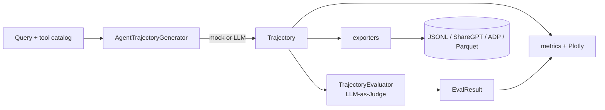
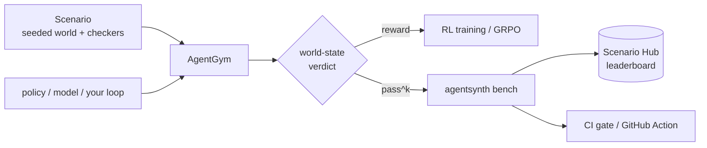

# Architecture

AgentSynth is a small, layered library. Everything is built on the Pydantic models
in `schemas.py`, and the heavy/optional dependencies (Plotly, pandas, datasets,
Gradio, LiteLLM) are imported lazily so the core stays light.

## Flow

A scenario adds a second flow — verify against the world, then bench and gate on it:

## Modules

| Module | Responsibility |
| --- | --- |
| `schemas.py` | The data model: `ToolSpec`, `TrajectoryStep`, `Trajectory`, `RubricScores`, `EvalResult`. Everything else depends on this and nothing else. |
| `utils.py` | Tool-catalog parsing, the `PythonREPL` that grounds code steps, and `LLMClient` — a thin LiteLLM wrapper that reports `available` and degrades to a no-op offline. |
| `generator.py` | `AgentTrajectoryGenerator`. Deterministic mock builders per mode, plus an LLM path that asks for a structured trajectory and falls back to mock on any failure. |
| `evaluator.py` | `TrajectoryEvaluator`. Structural per-dimension scoring for the offline judge; an LLM judge that returns rubric JSON, falling back to structural. |
| `scenarios.py` | Outcome-checked tasks: a `Scenario` bundles a seeded world, a goal, and checkers (`SqlCheck`, `HttpCheck`, `CalledTool`, `AnswerContains`). `run_scenario_suite` turns a pack into an outcome pass-rate; `load_scenarios` / `save_scenarios` (de)serialize YAML packs. |
| `robustness.py` | How gameable a pack is: `audit_pack` runs trivial adversaries (canned answer, echoed prompt, throwaway call), detects leaked answers and no-op-satisfiable state checks, and `perturb_scenario` / `ipt_report` confirm a real solver survives an isomorphic sibling while a replayed transcript doesn't. |
| `synth.py` | Verifiers from a demonstration: `scenario_from_demonstration` runs the actions, diffs the end state, and writes state checks for exactly what changed; `pack_from_demonstrations` emits a pack + oracle that validate and audit clean. |
| `pack_export.py` | Ship a pack into the open ecosystems: `scenario_reward` / `reward_from_messages` (portable verifiable reward), and `export_pack` writes an OpenEnv server or a Prime Intellect `verifiers` environment, Hub-ready. |
| `reliability.py` | Beyond pass@1: `reliability_report` turns per-trial passes into the pass^1..pass^k decay curve (unbiased all-must-pass estimator), Wilson confidence intervals, and a flakiness breakdown. Drives the `bench --trials` output. |
| `contamination.py` | Is the benchmark already in the training set? `canary_for` mints a per-scenario token, `corpus_overlap` flags tasks a model may have seen, and `held_out_pack` rewrites the labels (via `perturb_scenario`) for a contamination-resistant variant. |
| `provenance.py` | Reproducible run manifests: `run_manifest` pins a content hash of the pack, the policy, seed, and outcomes into a `run_hash`; `verify_run` re-runs and confirms it reproduced. The leaderboard's anti-fabrication layer. |
| `usersim.py` | Multi-turn user-simulator scenarios (τ²-bench style): `run_conversation` runs a policy through a scenario's `metadata["user_turns"]` against one persistent world, grading the end state after the whole exchange. |
| `rl/` | `AgentGym` wraps a scenario as a gym episode whose terminal reward is the world-state verdict; `make_reward_fn` plugs it into TRL's `GRPOTrainer`, and `to_openenv` bridges onto the OpenEnv standard. |
| `adapters.py` | Bridge an OpenAI-style agent to a gym: `to_openai_tools` emits function-calling schemas, `action_from_openai_tool_call` converts a tool call back into a gym action. Bring your own loop, no rewrite. |
| `verification/` | Verifiers that confirm a trajectory is sound (`ExecutionVerifier` re-runs code and checks the output reproduces; tool-arg and safety checks), an `EnsembleEvaluator`, a `LearnedVerifier` distilled from the judge, and rubric presets. |
| `benchmarks/` | A function-calling benchmark (`run_benchmark`, `compare_models`, `BUILTIN_CASES`) with before/after tables, plus BFCL / τ-bench adapters. |
| `environments/` | Pluggable backends that run tool calls for real: `SQLEnvironment` (in-memory SQLite), `PythonSandbox` (isolated subprocess), `DockerSandbox` (container-isolated code), `MCPEnvironment` (any MCP server), `BrowserEnvironment` (headless Chromium via Playwright), `RestEnvironment` (any OpenAPI spec over plain HTTP), and `CompositeEnvironment`. Optional — without one, observations are templated. |
| `tasks/` | A seed-task taxonomy across domains with a deterministic sampler, for diverse batches. |
| `pipelines/` | `Recipe` (loadable from YAML) and `run_recipe` — generate (optionally concurrent), dedup, evaluate, verify, compute metrics, export, in one call. |
| `importers.py` | Turn external logs into `Trajectory` objects — OpenAI / Anthropic `tool_use` and OpenTelemetry GenAI spans — plus `redact_text` / `redact_trajectory` to strip secrets before sharing. |
| `mining.py` | Failure mining: categorize benchmark and judge misses (`mine_failures`, `mine_judge_failures`) and turn them into a focused next run (`recipe_from_failures`). |
| `evolve.py` | `evolve_queries` — template or LLM-paraphrase expansion of a query set into harder variants. |
| `preferences.py` | Build chosen/rejected pairs from scored trajectories and export DPO JSONL. |
| `training/` | Trainer-ready dataset prep: `build_sft_dataset` / `build_dpo_dataset` and the record converters. |
| `metrics.py` | Dataset aggregates (`compute_dataset_metrics`, `diversity_score`) and the Plotly figures. |
| `exporters.py` | `to_jsonl` / `load_jsonl` (round-trippable), `to_sharegpt`, `to_adp`, `to_parquet`, `save_dataset`. |
| `dedup.py` | Jaccard-shingle and MinHash near-duplicate removal, and benchmark decontamination. |
| `scale.py` | Run generation like a job: `CachingLLMClient`, a `CostMeter` with a hard `BudgetExceeded` cap, and `run_resumable` checkpoints. |
| `hub.py` | Push a dataset to the Hugging Face Hub with an auto-generated card (`push_dataset`, `dataset_card`). |
| `demo.py` | The reference policies (`expert` / `read_only` / `lazy`) and the pack the playground runs. |
| `cli.py` | The `agentsynth` console script: `generate`, `eval`, `import`, `flywheel`, `bench` (pass^k / reliability / compare / submit), and `pack` (new / validate / teach / audit / export / contamination / verify-run). |
| `app.py` (repo root) | The Gradio playground. The only module that imports Gradio at the top. Importing it builds `demo` without calling an LLM. |
| `hub/` (repo root) | The Scenario Hub: a FastAPI service that stores packs and submissions and serves the live leaderboard. |

## Design decisions

**Mock-or-LLM, never mock-then-LLM.** Each generator and evaluator path decides up
front whether it has a usable LLM client. The mock path is fully deterministic
(seeded through `stable_seed`), which is what makes the test suite stable and lets
the offline demo behave predictably.

**Grounded code execution.** `code_execution` steps don't trust the model's idea of
what its code prints. The code runs through `PythonREPL` and the real stdout is
recorded. (That REPL is a convenience, not a security sandbox — see `SECURITY.md`.)

**Flat, self-describing trajectories.** A `Trajectory` carries its tools, its typed
steps, and a rendered `messages` view. JSONL export is round-trippable so a dataset
can be loaded back into objects without a bespoke parser, and ShareGPT/ADP are
derived from the same source.

**Rubric as data.** The six dimensions and their weights live in `schemas.py`
(`RUBRIC_DIMENSIONS`, `DEFAULT_RUBRIC_WEIGHTS`). The judge — mock or LLM — fills in
scores; the overall is a weighted mean you can re-weight.

## Extension points (today and planned)

- New tools: pass any JSON-Schema / OpenAI-style catalog to `parse_tool_catalog`.
- New scenario pack: `agentsynth pack new` scaffolds one — with an oracle and the
  validation gate — for a domain you know. See `packs/README.md`.
- Bring your own agent loop: drive any gym from an OpenAI-style agent via
  `to_openai_tools` / `action_from_openai_tool_call`.
- New environment: subclass `Environment` and register it in `make_environment`.
- New export format: add a function in `exporters.py` and wire it into `save_dataset`.
- New rubric weighting: pass `weights=` to `TrajectoryEvaluator`.
- See `ROADMAP.md` for what's planned.
