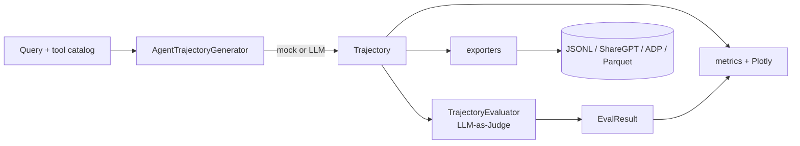

# Architecture

AgentSynth is a small, layered library. Everything is built on the Pydantic models
in `schemas.py`, and the heavy/optional dependencies (Plotly, pandas, datasets,
Gradio, LiteLLM) are imported lazily so the core stays light.

## Flow

## Modules

| Module | Responsibility |
| --- | --- |
| `schemas.py` | The data model: `ToolSpec`, `TrajectoryStep`, `Trajectory`, `RubricScores`, `EvalResult`. Everything else depends on this and nothing else. |
| `utils.py` | Tool-catalog parsing, the `PythonREPL` that grounds code steps, and `LLMClient` — a thin LiteLLM wrapper that reports `available` and degrades to a no-op offline. |
| `generator.py` | `AgentTrajectoryGenerator`. Deterministic mock builders per mode, plus an LLM path that asks for a structured trajectory and falls back to mock on any failure. |
| `evaluator.py` | `TrajectoryEvaluator`. Structural per-dimension scoring for the offline judge; an LLM judge that returns rubric JSON, falling back to structural. |
| `metrics.py` | Dataset aggregates (`compute_dataset_metrics`, `diversity_score`) and the Plotly figures. |
| `exporters.py` | `to_jsonl` / `load_jsonl` (round-trippable), `to_sharegpt`, `to_adp`, `to_parquet`, `save_dataset`. |
| `environments/` | Pluggable backends that run tool calls for real: `SQLEnvironment` (in-memory SQLite), `PythonSandbox` (isolated subprocess), `MCPEnvironment` (any MCP server), `BrowserEnvironment` (headless Chromium via Playwright), `RestEnvironment` (any OpenAPI spec over plain HTTP), and `CompositeEnvironment`. Optional — without one, observations are templated. |
| `tasks/` | A seed-task taxonomy across domains with a deterministic sampler, for diverse batches. |
| `pipelines/` | `Recipe` (loadable from YAML) and `run_recipe` — generate (optionally concurrent), dedup, evaluate, verify, compute metrics, export, in one call. |
| `verification/` | Verifiers that confirm a trajectory is sound (`ExecutionVerifier` re-runs code and checks the output reproduces; tool-arg and safety checks), an `EnsembleEvaluator`, and rubric presets. |
| `preferences.py` | Build chosen/rejected pairs from scored trajectories and export DPO JSONL. |
| `dedup.py` | Jaccard-shingle near-duplicate removal and benchmark decontamination. |
| `cli.py` | The `agentsynth generate` / `agentsynth eval` console script. |
| `app.py` (repo root) | The Gradio UI. The only module that imports Gradio at the top. Importing it builds `demo` without calling an LLM. |

## Design decisions

**Mock-or-LLM, never mock-then-LLM.** Each generator and evaluator path decides up
front whether it has a usable LLM client. The mock path is fully deterministic
(seeded through `stable_seed`), which is what makes the test suite stable and lets
the offline demo behave predictably.

**Grounded code execution.** `code_execution` steps don't trust the model's idea of
what its code prints. The code runs through `PythonREPL` and the real stdout is
recorded. (That REPL is a convenience, not a security sandbox — see `SECURITY.md`.)

**Flat, self-describing trajectories.** A `Trajectory` carries its tools, its typed
steps, and a rendered `messages` view. JSONL export is round-trippable so a dataset
can be loaded back into objects without a bespoke parser, and ShareGPT/ADP are
derived from the same source.

**Rubric as data.** The six dimensions and their weights live in `schemas.py`
(`RUBRIC_DIMENSIONS`, `DEFAULT_RUBRIC_WEIGHTS`). The judge — mock or LLM — fills in
scores; the overall is a weighted mean you can re-weight.

## Extension points (today and planned)

- New tools: pass any JSON-Schema / OpenAI-style catalog to `parse_tool_catalog`.
- New export format: add a function in `exporters.py` and wire it into `save_dataset`.
- New rubric weighting: pass `weights=` to `TrajectoryEvaluator`.
- Planned: pluggable execution environments and verifiers, and an MCP tool source.
  See `ROADMAP.md`.
